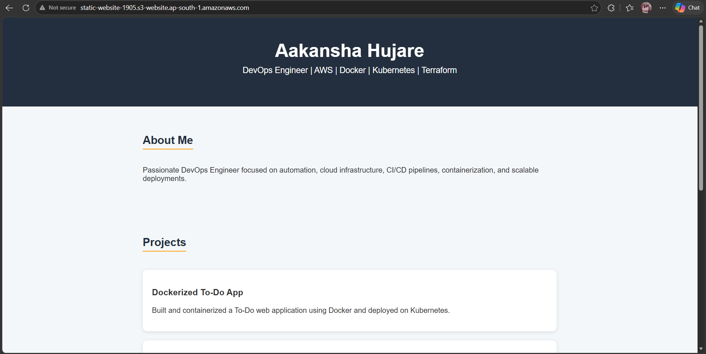

# AWS Static Website Hosting using Terraform

Automated static website deployment on AWS using Terraform and Amazon S3.

## Project Overview
This project demonstrates how to deploy a static website on AWS using Infrastructure as Code (IaC) with Terraform.

Terraform automatically provisions:
- S3 bucket
- Static website hosting
- Bucket policy
- Website file uploads

The website is publicly accessible through an S3 website endpoint.

---

## Technologies Used
- Terraform
- AWS S3
- AWS CLI
- Infrastructure as Code (IaC)

---

## Features
- Automated AWS infrastructure deployment
- S3 static website hosting
- Public access bucket policy
- Website endpoint output
- HTML file upload automation

---

## Project Structure

```bash
terraform-aws-static-website/
├── index.html
├── error.html
├── provider.tf
├── main.tf
├── variables.tf
├── outputs.tf
├── terraform.tfvars
├── .gitignore
└── README.md
```

---

## Terraform Files

### provider.tf
Configures AWS provider and region.

### main.tf
Creates:
- S3 bucket
- Static website hosting
- Bucket policy
- Website objects

### variables.tf
Stores reusable variables like:
- AWS region
- Bucket name

### outputs.tf
Displays website endpoint URL after deployment.

### terraform.tfvars
Stores variable values.

---

## Terraform Commands Used

```bash
terraform init
terraform validate
terraform plan
terraform apply
terraform output
```

---

## Deployment Steps
1. Configured AWS CLI
2. Created Terraform configuration files
3. Initialized Terraform
4. Validated configuration
5. Previewed infrastructure using plan
6. Applied infrastructure changes
7. Accessed live S3 static website

---

## Website Output

<p align="center">
  
</p>

---

## Learning Outcome
Through this project, I learned:
- Infrastructure as Code (IaC)
- Terraform workflow
- AWS resource automation
- S3 static website deployment
- Terraform state management

---

## Future Improvements
- CloudFront integration
- Custom domain with Route 53
- CI/CD pipeline using GitHub Actions

---

## Author
Aakansha Hujare
