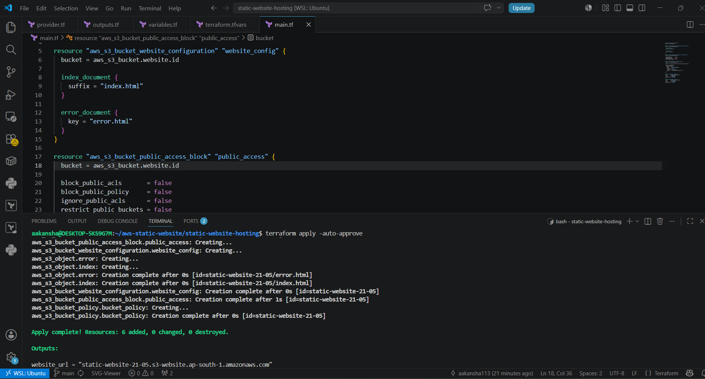
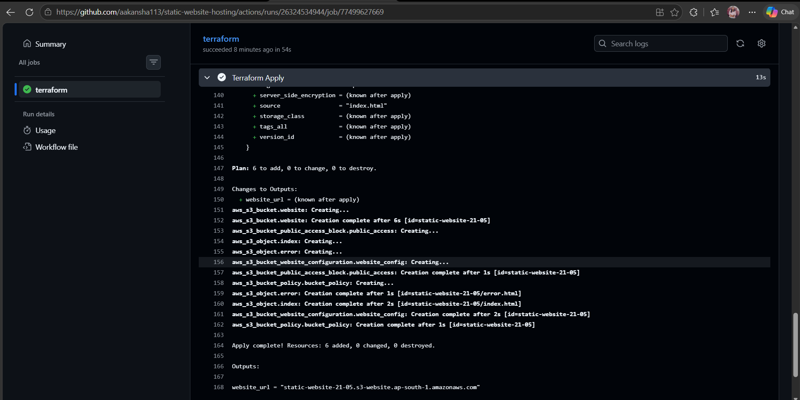
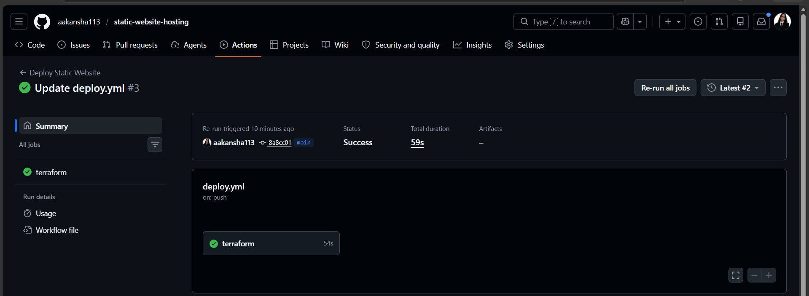

# AWS Static Website CI/CD Pipeline using Terraform & GitHub Actions

Automated static website deployment on AWS using Terraform, GitHub Actions, and Amazon S3.

---

## Project Overview

This project demonstrates how to deploy and automate a static website on AWS using Infrastructure as Code (IaC) and CI/CD practices.

The project was completed in 3 phases:

### Part 1 — Manual AWS S3 Static Website Hosting
- Created S3 bucket manually
- Enabled static website hosting
- Configured public bucket policy
- Hosted website on AWS

### Part 2 — Terraform Automation
- Automated infrastructure using Terraform
- Created reusable Terraform configuration files
- Automated website deployment

### Part 3 — CI/CD using GitHub Actions
- Integrated GitHub Actions workflow
- Automated Terraform deployment pipeline
- Triggered deployments on Git push

---

## Technologies Used

- Terraform
- GitHub Actions
- AWS S3
- AWS IAM
- AWS CLI
- Infrastructure as Code (IaC)
- CI/CD Pipeline

---

## Features

- Automated AWS infrastructure deployment
- S3 static website hosting
- GitHub Actions CI/CD pipeline
- Public bucket policy configuration
- Website file upload automation
- Terraform workflow automation

---

## CI/CD Workflow

```text
Git Push → GitHub Actions → Terraform → AWS S3
```

---

## Project Structure

```bash
aws-static-website-project/
├── .github/
│   └── workflows/
│       └── deploy.yml
├── index.html
├── error.html
├── provider.tf
├── main.tf
├── variables.tf
├── outputs.tf
├── terraform.tfvars
├── .gitignore
├── README.md
└── src/
    ├── manual.png
    ├── terraform-output.png
    └── github-actions.png
```

---

## Terraform Files

### provider.tf
Configures AWS provider and region.

### main.tf
Creates:
- S3 bucket
- Static website hosting
- Bucket policy
- Website objects

### variables.tf
Stores reusable variables:
- AWS region
- Bucket name

### outputs.tf
Displays website endpoint URL after deployment.

### terraform.tfvars
Stores variable values.

---

## GitHub Actions Workflow

The workflow automatically runs on every push to the `main` branch.

### Workflow Steps
- Checkout Repository
- Setup Terraform
- Configure AWS Credentials
- Terraform Init
- Terraform Validate
- Terraform Plan
- Terraform Apply

---

## Terraform Commands Used

```bash
terraform init
terraform validate
terraform plan
terraform apply
terraform output
terraform destroy
```

---

## Deployment Steps

1. Configured AWS CLI
2. Created Terraform configuration files
3. Initialized Terraform
4. Validated Terraform configuration
5. Applied infrastructure changes
6. Created GitHub Actions workflow
7. Added AWS IAM credentials as GitHub Secrets
8. Triggered automatic deployment using Git push
9. Destroyed infrastructure after testing

---

## Website Output

Application UI

🎥 Demo Video:

https://github.com/aakansha113/static-website-hosting/raw/main/src/demo.mp4

<p align="center">
  
</p>

<p align="center">
  
</p>

---

## GitHub Actions Workflow Output

<p align="center">
  
</p>


<p align="center">
  
</p>

---

## Learning Outcome

Through this project, I learned:
- Infrastructure as Code (IaC)
- Terraform workflow
- AWS S3 automation
- GitHub Actions workflows
- CI/CD pipeline implementation
- AWS IAM credential management
- Automated cloud deployment
- Terraform state management

---

## Future Improvements

- CloudFront integration
- HTTPS support
- Custom domain with Route 53
- Remote Terraform backend using S3
- Terraform state locking with DynamoDB

---

## Author

Aakansha Hujare
